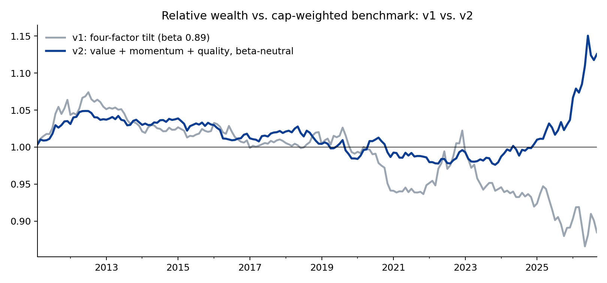

# Multi-Factor US Large Cap Equity Strategy

A long-only, sector-neutral, beta-neutral tilt toward **value, momentum and quality** in US large caps, built end-to-end from free data
(Yahoo Finance prices, SEC EDGAR XBRL fundamentals) with point-in-time discipline, transaction costs and turnover control.
Backtest: **Feb 2011 - Sep 2026** (188 months). Deliverables: this repo, a [two-page factsheet](output/Factsheet_MultiFactor_US_LargeCap.pdf)
and an [interactive dashboard](output/dashboard.html).

> Hypothetical backtest for research and discussion. Not investment advice.

## Headline results (net of 10 bps per dollar traded)

| | v1: four-factor tilt | v2: beta-neutral, 3-factor |
|---|---|---|
| Annualised return (net) | 14.8% | 16.6% |
| Benchmark return | 15.7% | 15.7% |
| Excess return | -0.9% | +0.9% |
| Tracking error | 3.2% | 2.2% |
| Information ratio | -0.30 | 0.36 |
| 90% bootstrap CI on IR | [-0.80, 0.01] | [-0.28, 0.64] |
| Sharpe (benchmark) | 1.02 (0.99) | 1.03 (0.99) |
| Beta | 0.89 | 1.00 |
| Max drawdown (benchmark) | -22.4% (-25.4%) | -25.7% (-25.4%) |




## v3 update (October 2026): 35 years, survivorship-free

Re-run on CRSP/Compustat via WRDS with true point-in-time S&P 500 membership and delisting returns, Feb 1990 – Dec 2024:
**+1.0%/yr excess, 2.3% tracking error, IR 0.38 (t = 2.25, 90% bootstrap CI [0.07, 0.65])**. The premium came from the 1990s (IR 1.1) and 2000s (0.49);
since 2010 it has been flat to negative. Survivorship bias in v2 inflated both benchmark and strategy by ~1.4%/yr and left the relative result
almost unchanged. Full note: [docs/v3_wrds.md](docs/v3_wrds.md). Raw WRDS data are not redistributed.

## The research story, in order

**v1** scored four factors (value, momentum, quality, low volatility) and tilted cap weights by `exp(score)` with sector neutrality, a 5% name cap
and a 20% turnover cap. It beat the benchmark on every risk metric (lower vol, smaller drawdowns, +6% relative in 2022) but lagged by
0.9%/yr. A Fama-French 5 + momentum regression of its active returns explained why: a market loading of
-0.075 (t = -6.6) and beta of 0.89. In a period when the market compounded at ~14% over cash, being 11% under-exposed
costs ~1.5%/yr, i.e. the whole gap. The factors had broken even; the low-vol sleeve had quietly shorted the bull market.

**v2** treats volatility as a *risk control* rather than a return factor: the composite is value + momentum + quality, and ex-ante portfolio beta is
matched to the benchmark using 252-day Vasicek-shrunk betas. Excess return moves to +0.9%, IR to 0.36, with tracking error of
2.2%. Both versions are reported. v2 was a single, pre-specified change motivated by the regression, not a grid search.

**What the backtest cannot tell you.** The 90% block-bootstrap interval on v2's IR is [-0.28, 0.64] (P(IR>0) = 76%). Fifteen years of one
US regime cannot distinguish an IR of 0.36 from zero; detecting a true 0.3 at conventional significance takes ~45 years. v2's edge is
concentrated in 2024-26 and driven by momentum (split-sample IR: [0.06, 0.54]).
The case for the strategy rests on the long, cross-country evidence for these premia and on the cleanliness of the implementation.

## Factor attribution (FF5 + MOM on monthly active returns)

| Factor | v1 loading (t) | v2 loading (t) |
|---|---|---|
| Alpha (ann.) | -0.004 (-0.7) | 0.003 (0.6) |
| Mkt-RF | -0.075 (-6.6) | 0.020 (1.9) |
| SMB | 0.053 (2.7) | 0.023 (1.2) |
| HML | 0.029 (1.5) | 0.018 (1.0) |
| RMW | 0.174 (8.3) | -0.016 (-0.8) |
| CMA | 0.103 (3.7) | 0.009 (0.3) |
| MOM | 0.082 (6.2) | 0.094 (7.5) |

v2's active return is explained by momentum; market, size, value and profitability loadings are insignificant, and alpha is indistinguishable
from zero. That is the intended outcome for a smart-beta product: it delivers the exposures it promises and nothing it doesn't.

## Single-factor sleeves (same construction, v2 beta-neutral spec)

| Sleeve | Excess ret | TE | IR |
|---|---|---|---|
| value | -0.5% | 3.0% | -0.14 |
| momentum | +2.9% | 5.3% | 0.52 |
| quality | -0.2% | 2.3% | -0.10 |
| lowvol | -2.0% | 3.9% | -0.51 |

## Pre-specified sensitivity grid (v1 construction, reported in full)

| Variant | Excess ret | TE | IR | Sharpe | Beta |
|---|---|---|---|---|---|
| Base (λ=1, cap 5%, TO 20%) | -0.9% | 3.2% | -0.30 | 1.02 | 0.89 |
| λ = 0.5 | -0.5% | 2.0% | -0.30 | 1.01 | 0.93 |
| λ = 2.0 | -1.0% | 4.8% | -0.24 | 1.03 | 0.84 |
| No single-name cap | -1.0% | 2.9% | -0.34 | 0.99 | 0.91 |
| Name cap 3% | -1.2% | 3.8% | -0.32 | 1.01 | 0.86 |
| Turnover cap 10% | -0.9% | 3.2% | -0.30 | 1.02 | 0.89 |
| No turnover cap | -0.9% | 3.2% | -0.30 | 1.02 | 0.89 |
| 3-factor (drop low-vol) | +0.7% | 2.9% | 0.21 | 1.02 | 0.99 |
| 3-factor (drop value) | -0.8% | 3.4% | -0.25 | 1.02 | 0.89 |

## Methodology

**Universe.** Current S&P 500 constituents (Wikipedia), 340-450 investable names per month. *Survivorship bias:* companies that failed are absent
from both strategy and benchmark, which is why the benchmark's 15.7% exceeds SPY's ~13.7% over the same window. Relative results
are apples-to-apples; absolute levels are inflated.

**Data.** Daily prices via `yfinance` (split-adjusted). Fundamentals via SEC `companyfacts` XBRL API: stockholders' equity, total assets, net income,
operating cash flow, shares outstanding. Every value carries its `filed` date and is only used after that date (no look-ahead); annual flows use
12-month-duration values; stale values (>18 months) are dropped. SEC share counts are historical, so they are multiplied by all subsequent splits
to match Yahoo's basis. A rolling-median filter removes XBRL scale errors (e.g. shares reported x1e6), which affected 458 of ~121k observations.
Exxon's 2026 holding-company CIK is mapped to the operating company's predecessor CIK.

**Signals.** Value = mean z of log(book/market) and earnings yield. Momentum = 12-1 month return. Quality = mean z of ROE and OCF/assets.
Each: winsorise at 3 sd -> demean within GICS sector -> z-score across universe, monthly. Composite = equal-weighted mean (>= 2 of 3 required).

**Construction.** `w_i ∝ cap_i · exp(score_i)` -> rescale sector weights to benchmark -> 5% single-name cap (iterative) -> re-tilt by `exp(γ(β_i − 1))`
with γ found by bisection so ex-ante beta = benchmark beta (re-imposing sector neutrality and cap). Monthly partial rebalance toward target such
that one-way turnover <= 20%; realised average is 11.4%/month. Cost: 10 bps per dollar traded (buys + sells).

**Benchmark.** Cap-weighted portfolio of the same investable universe each month.

## Repository layout

```
src/
  config.py        parameters
  universe.py      S&P 500 constituents + CIKs
  prices.py        yfinance daily prices           splits.py   split history
  fundamentals.py  SEC EDGAR XBRL point-in-time pull
  factors.py       signals, z-scoring, betas, composites
  portfolio.py     tilt, sector neutrality, name cap, beta match, turnover control, costs
  backtest.py      monthly simulation (v1, v2, single-factor sleeves)
  analytics.py     metrics, stress periods, FF regression, exposures, charts
  stats.py         block bootstrap on IR, split-sample test
  sensitivity.py   pre-specified robustness grid
  factsheet.py     two-page PDF          dashboard.py   Plotly HTML
output/            returns, weights, tables (csv), figures/, factsheet, dashboard
```

Run order: `universe -> prices -> splits -> fundamentals -> factors -> backtest -> analytics -> stats -> sensitivity -> factsheet -> dashboard`.

## Next steps

1. Survivorship-free universe and 1960s+ history via CRSP/Compustat (WRDS) - the only change that could produce a statistically convincing result.
2. Intangible-adjusted value (capitalised R&D/SG&A) and EV multiples; value was the most diluted exposure and the most exposed to the intangibles problem.
3. Optimiser with an explicit tracking-error budget instead of the heuristic tilt; tolerance-band rebalancing.
4. International developed markets, where factor premia have been stronger.

*Hugo Hoenn, September 2026.*
