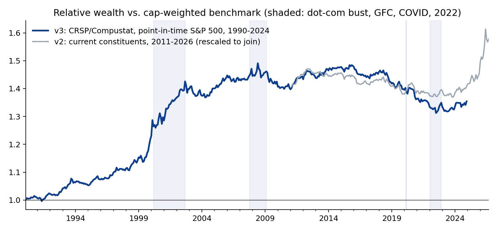
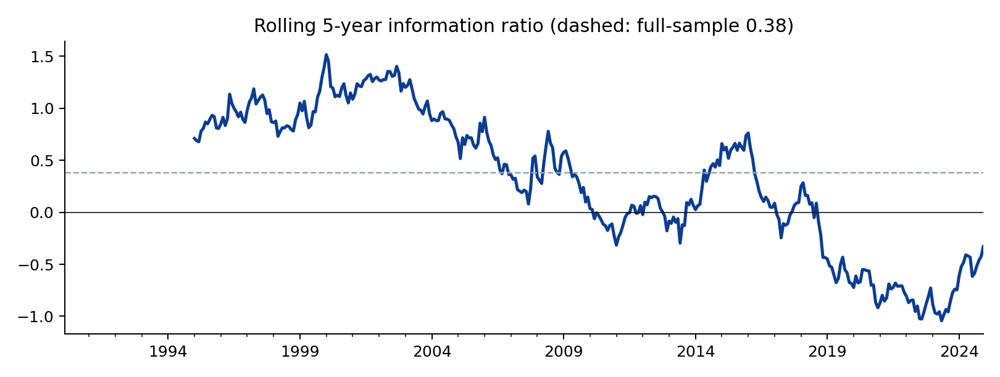
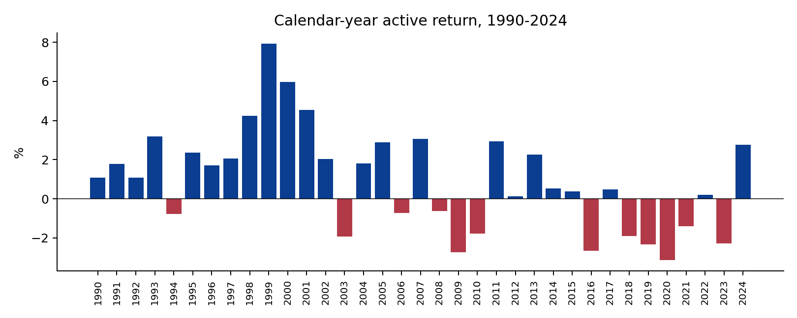
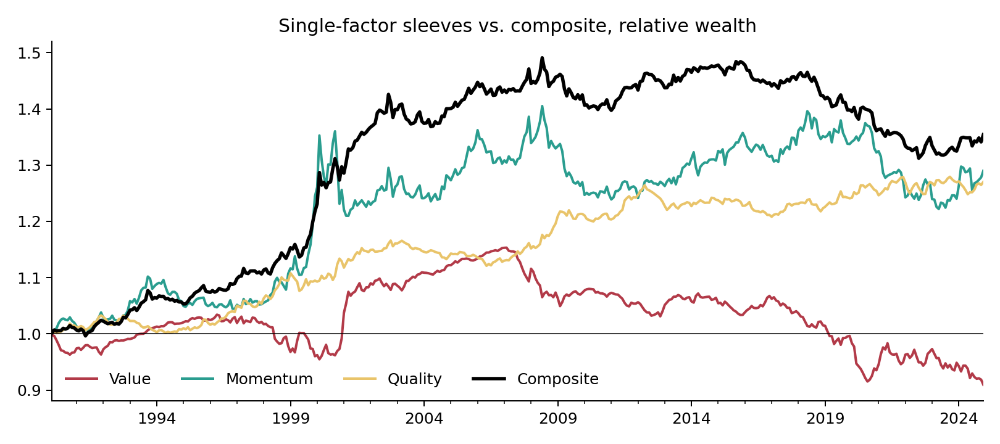

# Multi-Factor Strategy v3: 35 Years, Survivorship-Free

*The v2 strategy re-run on CRSP and Compustat data via WRDS: true point-in-time S&P 500 membership, delisted companies included, Feb 1990 – Dec 2024. Hugo Hoenn, October 2026.*

The two limitations that the v2 write-up put in bold were survivorship bias (a universe of today's constituents) and a fifteen-year, one-regime
sample that could not distinguish an information ratio of 0.36 from zero. Access to CRSP and Compustat through Wharton Research Data Services
removes both. This note re-runs the identical construction — value, momentum and quality composite, sector-neutral by Fama-French industry,
beta-neutral, 5% name cap, 20% turnover cap, 10 bp costs — on the S&P 500 as it actually existed each month, using CRSP's constituent history and
returns that include delisting returns, and Compustat fundamentals made available six months after fiscal year-end. About 495 investable
names per month; 1,528 distinct companies over the period.

## 1. The 35-year result

| | Strategy | Benchmark |
|---|---|---|
| Annualised return | 11.9% | 10.9% |
| Volatility | 14.6% | 14.8% |
| Sharpe | 0.67 | 0.60 |
| Max drawdown | -50.0% | -50.5% |
| Excess return / tracking error | +1.0% / 2.3% | |
| **Information ratio** | **0.38** (t = 2.25) | |
| 90% block-bootstrap CI on IR | [0.07, 0.65], P(IR &gt; 0) = 98% | |
| Beta | 0.98 | 1.00 |

The numbers are almost exactly v2's (+0.9%, 2.2% TE, IR 0.36) — which is itself informative: the construction is stable across data sources
and universes — but now over 419 months and four distinct market regimes, and the bootstrap interval excludes zero. The strategy beat its
benchmark in 23 of 35 calendar years and in 56.1% of months.

## 2. Where the premium came from — and when it stopped

| Period | Excess return | TE | IR | Sharpe (bench.) | Max DD (bench.) |
|---|---|---|---|---|---|
| 1990s (1990-99) | +2.4% | 1.8% | 1.12 | 1.18 (1.05) | -14.6% (-15.2%) |
| 2000s (2000-09) | +1.6% | 3.1% | 0.49 | -0.04 (-0.13) | -50.0% (-50.5%) |
| 2010s (2010-19) | -0.2% | 1.6% | -0.11 | 1.02 (1.04) | -15.1% (-16.1%) |
| 2020-24 | -0.7% | 2.1% | -0.33 | 0.68 (0.71) | -24.9% (-23.5%) |

This is the finding. The full-sample significance is earned almost entirely before 2010. In the 1990s the tilt delivered an information ratio above
one; in the 2000s, dominated by the dot-com bust and the financial crisis, roughly half that; since 2010, nothing. The 2010s and 2020s IRs are
negative and indistinguishable from zero, exactly as the v2 write-up found on its shorter sample. Value, momentum and quality tilts in US large
caps worked for two decades and have not worked for fifteen years.

Three readings are consistent with this, and the data cannot separate them: the premia were arbitraged away as they became widely known and
cheaply investable (the McLean–Pontiff pattern; smart-beta ETF assets went from near zero to hundreds of billions over exactly this window);
the mega-cap growth regime since 2010 is a long but temporary headwind that a sector-neutral, beta-neutral tilt cannot hedge; or the 1990s
result was itself partly luck. A client should be told all three, and told that the post-2010 stretch is now long enough to be uncomfortable but
still short enough that none of the three can be ruled out.

## 3. How much did survivorship bias distort v2?

Running v2 (current constituents, Yahoo/SEC data) and v3 (point-in-time, CRSP/Compustat) over their common window:

| Feb 2011 – Dec 2024 | Strategy | Benchmark | Excess | TE | IR | Sharpe |
|---|---|---|---|---|---|---|
| v2 (current constituents) | 15.1% | 15.0% | +0.0% | 1.5% | 0.02 | 0.97 |
| v3 (CRSP/Compustat, point-in-time) | 13.4% | 13.6% | -0.3% | 1.8% | -0.13 | 0.87 |

Survivorship inflated the benchmark by about 1.4%/yr and the strategy by a similar amount, so the *relative* result was little affected — the
two active-return series are 0.73 correlated — which validates the earlier claim that the bias affected both legs alike. It also shows that
v2's headline +0.9%/yr came almost entirely from 2025–26, which v3 (ending Dec 2024) does not cover; on the identical window both versions
are flat. The methodology travelled across data sources; the excess return did not travel across sub-periods.

## 4. Attribution and stress

| Factor | Loading | t |
|---|---|---|
| Alpha (ann.) | +0.004 | 1.1 |
| Mkt-RF | +0.003 | 0.4 |
| SMB | +0.039 | 2.8 |
| HML | +0.012 | 0.9 |
| RMW | -0.009 | -0.5 |
| CMA | -0.035 | -1.6 |
| MOM | +0.094 | 10.7 |

R² 0.46. Over 35 years the active return is almost entirely a momentum exposure (t = 10.7) with a small-cap tilt from the mega-cap
underweight; the value and profitability loadings are insignificant. Residual alpha of +0.4%/yr (t = 1.1) is not distinguishable from zero.

| Period | Strategy | Benchmark | Relative |
|---|---|---|---|
| 1990 recession (Jul-Oct 1990) | -13.5% | -14.2% | +0.8% |
| LTCM (Aug-Sep 1998) | -7.8% | -8.9% | +1.1% |
| Dot-com bust (Mar 2000-Sep 2002) | -30.5% | -37.2% | +6.8% |
| GFC (Oct 2007-Feb 2009) | -48.9% | -49.6% | +0.8% |
| COVID (Feb-Mar 2020) | -19.8% | -19.4% | -0.5% |
| 2022 | -17.6% | -17.8% | +0.2% |

The strategy fell with the market in every crisis, slightly less in most, and gave back nothing it did not have: beta-neutral construction means
the drawdowns match the benchmark's by design. Its largest relative gain was the dot-com bust (+6.8%), which is when value and quality earned their reputation.

Single-factor sleeves, same construction: | Sleeve | Excess return | TE | IR |
|---|---|---|---|
| value | -0.3% | 2.3% | -0.09 |
| momentum | +0.8% | 3.8% | 0.21 |
| quality | +0.8% | 1.5% | 0.45 |

Quality is the most consistent sleeve on a risk-adjusted basis; value alone did not pay over the full 35 years in this universe.

## What this cannot tell you

- Whether the post-2010 decay is permanent. Fifteen flat years after twenty good ones is consistent with both "arbitraged away" and "long headwind".
- Anything about small caps, international markets or long-short implementations, where the academic evidence for these premia is stronger.
- The universe is the S&P 500; a committee-selected index. The 500 largest stocks by market cap would be a cleaner universe and is the next test.
- Costs are a flat 10 bp; realistic 1990s costs were higher, which would trim the 1990s result somewhat.

## Data and code

CRSP monthly stock file (v2, CIZ format, delisting-inclusive returns), CRSP S&P 500 constituent history, Compustat Fundamentals Annual, and the
CRSP/Compustat link table, all via WRDS. Raw data are licensed and not redistributed; only derived tables and figures are published.
`src/wrds_data.py` builds the panels, `src/v3_backtest.py` runs the strategy (reusing `portfolio.py` unchanged), `src/v3_analysis.py` produces the
tables and figures in `output/v3/`.

*Independent research. Not investment advice.*
